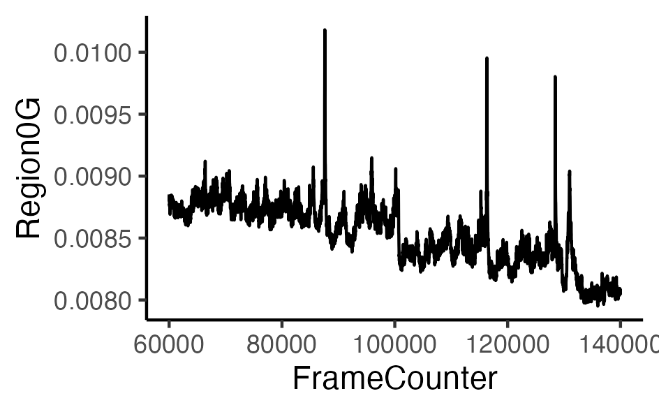
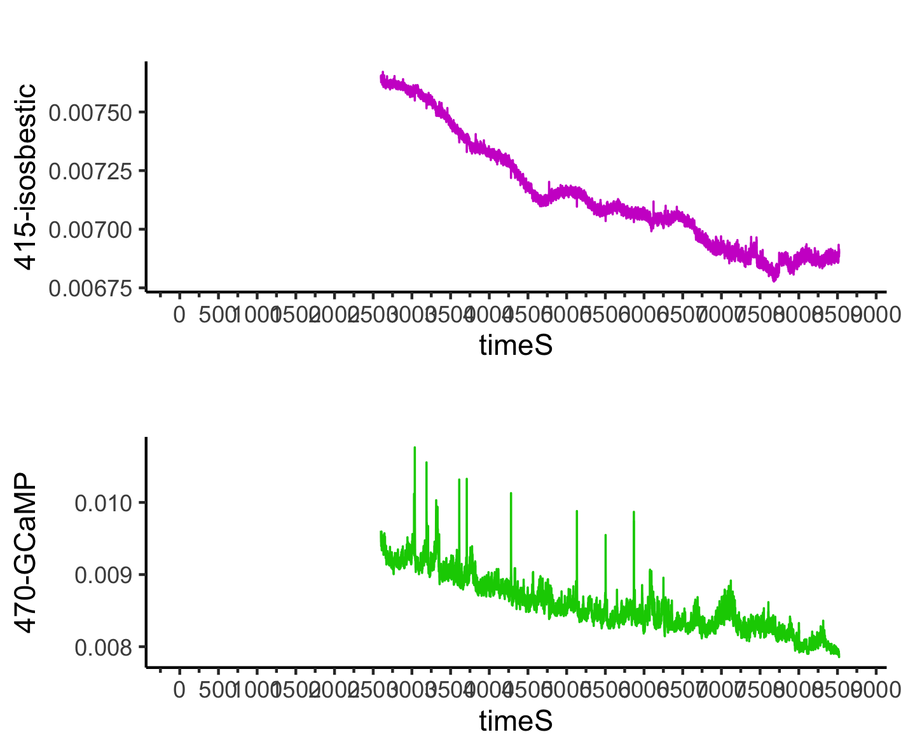
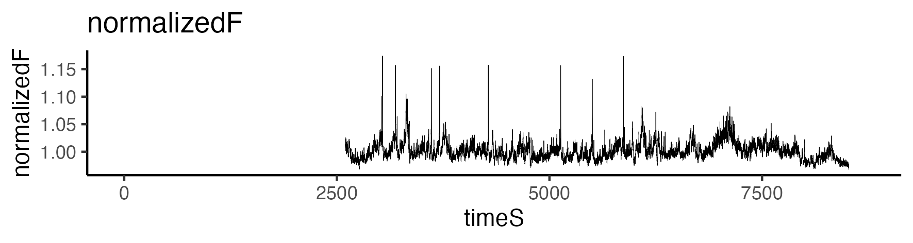
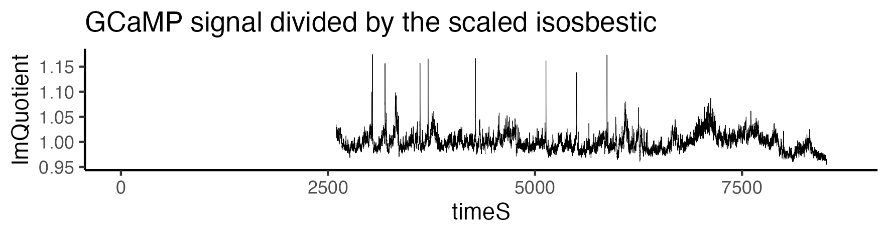
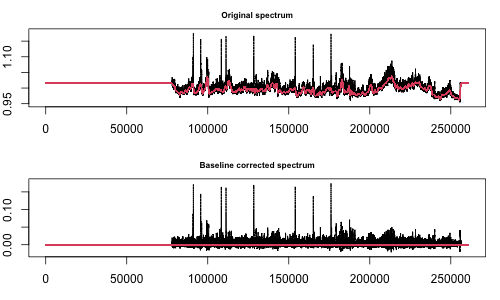

R script for analysis of fiber photometry, behavior, and body temperature
================


## Introduction

Fiber photometry is a way to record neuronal calcium events in animals during naturalistic behavioral and physiological responses. These three scripts serve two functions.
(1) Process fiber photometric data to yield different options of dF/F.
(2) Align the dF/F data with behavior and body temperature data steams. 

## Installation
* One option is to install these scripts by cloning them with Git :

    For this, run the following commands :

    ```
    cd folder/to/clone/into
    git clone https://github.com/adamcnelson/Fiber_photometry
    ```

## Script 1: processing FP data from the Neurophotometrics system.
 
 Features:

-   Bleach detrending 
-   Data smoothing
-   Remove high-frequency noise 
-   Trim off fluorescence values from the first last/minutes of recording (user defined)
-   Baseline correction
-   Date-time timestamp (POSIXct)
-   Find peaks
-   Calculate dF/F using a number of different methods

### Example dataset
The following data was read in from the [Neurophotometrics system using a Bonsai workflow](https://neurophotometrics.com/bonsai-manual). Note that in this workflow the fluorescence data and associated timestamp values are read in as separate files.

Isosbestic channel: LedState == 1

GCaMP channel:  LedState == 2

``` r
all_dat
```


``` r
computerClock
```


### Smooth data 
The ButterEndEffect function removes high-frequency noise
``` r
ButterEndEffect
```
Before


After



Alternatively, use the `rollapply` function to smooth the data with a rolling average

### Convert fluorescence values at beginning / end of recording to `NA`
The beginning and end of a fiber photometry recording is very often noisy due to artifacts. The `trim_region0G` function converts calcium fluorescence values to NA for a user-defined number of minutes. 

``` r
trim_region0G <- function(data, led_state, trim, trim2) {
  data %>%
    dplyr::filter(LedState == led_state) %>%
    mutate(Region0G = ifelse(row_number() <= trim | row_number() >= trim2, NA, Region0G))
}
```

We often remove fluorescence from at least the first 10 minutes (~20,000 rows at 30 Hz). 

Visualize aligned calcium-dependent (GCaMP) and calcium-independent (isosbestic) signals using `ggplotGrob`



### Normalize data 
Here I present a few options for detrending the data and dealing with outlier values. 
#### Option 1: Correct the GCaMP data with an exponential decay model fit to the isosbestic data 

 -  Here we use `nls`, the R base function to fit non-linear equations, and `SSasymp`, a self-starting function that guesses its own start parameters. To retain the original number of rows in the data, use `na.exclude`. Use Broom's `augment` funciton to extract the predicted values. 
 
``` r
fit <- nls(Region0G ~ SSasymp(timeS, yf, y0, log_alpha), 
           data = isos, 
           na.action=na.exclude) #if it doesnt run with na.exclude, try na.omit

fitted = augment(fit, newdata=isos)
paraters = tidy(fit)
```
-   Linearly scale the fitted decay to the GCaMP (470) data using robust fit with a bisquare weighting function (rr.bisquare)
``` r
rr.bisquare <- rlm(Region0G ~ .fitted, data=gcamp.fitted, psi = psi.bisquare, na.action = na.exclude)
```
-   Then scale the fitted decay with coefficients from the robust fit (FP_lit_fit).
``` r
gcamp.fitted2$FP.lin_fit = gcamp.fitted2$.fitted * rr.bisquare$coefficients[[2]] + rr.bisquare$coefficients[[1]]
```

- Plot the linearly scaled exponential decay fit (red line) over the GCaMP (470) data (black line)


-   Finally, derive a normalized fluoresence value by dividing the GCaMP (470) values by the scaled fit (FP_lit_fit). 
``` r
gcamp.fitted2$normalizedF = gcamp.fitted2$Region0G/gcamp.fitted2$FP.lin_fit
```


#### Option 2: Correct the GCaMP data with an linear model fit to GCaMP (470) and isosbestic (415) values.
-   Extract the fitted values of this regression using `lm` and Broom's `augment` function 
```r
scaled415.470 = lm(Region0G ~ Region0G.415 , data = gcamp.fitted3)
lm.fitted = augment(scaled415.470, newdata=gcamp.fitted3)
```
-   Divide the GCaMP (470) signal by the fitted values
```r
gcamp.fitted3 = gcamp.fitted3 %>% 
  dplyr::mutate(lmQuotient = Region0G/scaled415.470)
```


In this example, the two different options produce very similar normalized dF/F calcium traces. However, depending on the details of a recording, they can sometimes be different. 

### Baseline correction
-   Because we observe occasional artifactual shifts in baseline dF/F values, we use the Baseline package's `baseline` funciton correct normalized dF/F data using the iterative least squares method. First we isolate lmQuotient, then do a baseline correction.
```r 
metric = gcamp.fitted3$lmQuotient
metric[is.na(metric)]<-mean(metric[1:trim*1.01],na.rm=TRUE)
metric.bc = baseline(matrix(metric, nrow=1), method='irls')
``` 



------------------------------------------------------------------------

Authors: Adam Nelson
