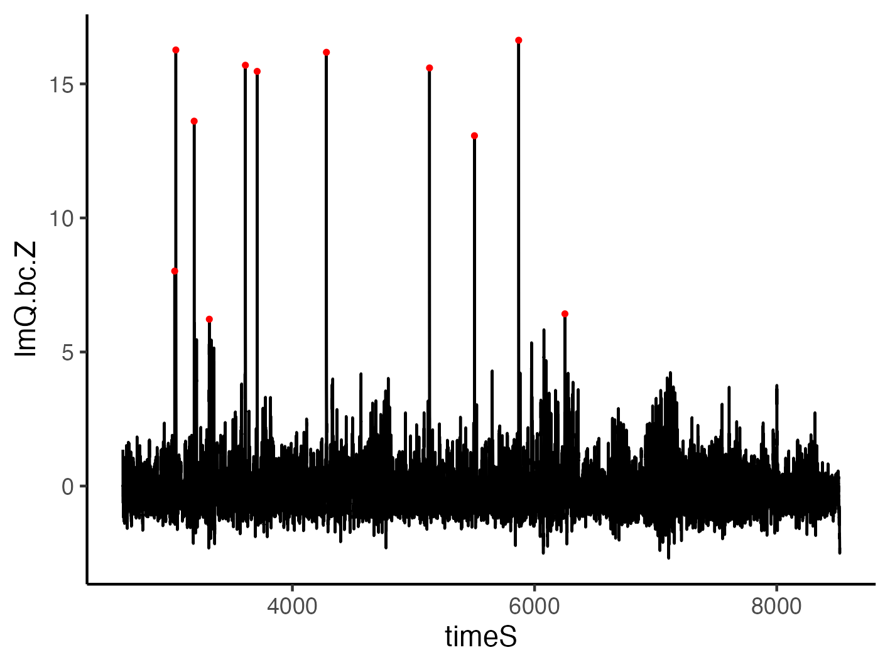
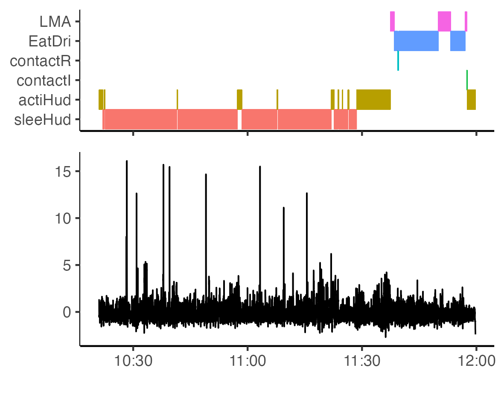
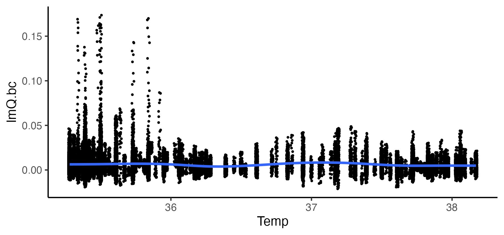

Analysis of fiber photometry, behavior, and body temperature time-series data using R. 
================


## Introduction

Fiber photometry is a way to record neuronal calcium events in the animal brain during naturalistic behavioral and physiological responses. These two scripts serve two functions.
(1) Process fiber photometric data to yield different options of dF/F.
(2) Align the dF/F data with behavior and body temperature data steams.

This resource is intended for researchers using R to process fiber photometric data alongside behavior and physiology time-series data. Many of the steps in Script 1 were cloned from Matlab signal processing routines. 

This README illustrates some of the key steps. 

## Installation
* One option is to install these scripts by cloning them with Git :

    For this, run the following commands :

    ```
    cd your/folder/to/clone/into
    git clone https://github.com/adamcnelson/Fiber_photometry
    ```

## Script 1: processing FP data from the Neurophotometrics system.
 
 Features:

-   Bleach detrending 
-   Remove high-frequency noise 
-   Trim off fluorescence values from the first last/minutes of recording (user defined)
-   Baseline correction
-   Date-time timestamp (POSIXct)
-   Find peaks
-   Calculate dF/F using a number of different methods

### Example dataset
The following data was read in from the [Neurophotometrics system using a Bonsai workflow](https://neurophotometrics.com/bonsai-manual). Note that in this workflow the fluorescence data and associated timestamp values are read in as separate files. Isosbestic channel: LedState == 1. GCaMP channel:  LedState == 2.

For reference, here is a tyical Bonsai workflow. 


Read in the data using `lapply` and `read.table`.
``` r
all_dat
```


``` r
computerClock
```


### Smooth data 
The `ButterEndEffect` function uses the signal package to remove high-frequency noise while padding for end effects. It takes as input a fourth-order butterworth filter. 
``` r
ButterEndEffect <- function(filt,x) {
  signal::filtfilt(filt,c(rev(x),x,rev(x)))[(length(x) + 1):(2 * length(x))]
}

#define filter and parameters
order <- 4  # Filter order
Hz <- 30 
cutoff <- 2/(Hz/2) # Cutoff frequency
b <- butter(order, cutoff, type="low")  filter coefficients

#incorporate the filter
all_dat3 = all_dat3 %>%
  dplyr::group_by(LedState) %>% 
  dplyr::mutate(Region0G = ButterEndEffect(b,Region0G))  %>%
  dplyr::ungroup() 

```
Before


After


Alternatively, use the `rollapply` function to smooth the data with a rolling average.

### Convert fluorescence values at beginning / end of recording to `NA`
The beginning and end of a fiber photometry recording is very often noisy due to artifacts. The `trim_region0G` function converts calcium fluorescence values to NA for a user-defined number of minutes. 

``` r
trim_region0G <- function(data, led_state, trim, trim2) {
  data %>%
    dplyr::filter(LedState == led_state) %>%
    mutate(Region0G = ifelse(row_number() <= trim | row_number() >= trim2, NA, Region0G))
}
```

We often remove fluorescence from at least the first 10 minutes (~20,000 rows at 30 Hz). 

Visualize aligned calcium-dependent (GCaMP) and calcium-independent (isosbestic) signals using `ggplotGrob`


### Normalize data 
Here I present a few options for detrending the data and dealing with outlier values. 
#### Option 1: Correct the GCaMP data with an exponential decay model fit to the isosbestic (415nm) data 

 -  Here we use `nls`, the R base function to fit non-linear equations, and `SSasymp`, a self-starting function that guesses its own start parameters. To retain the original number of rows in the data, use `na.exclude`. Use Broom's `augment` function to extract the predicted values, and `tidy` to extract the parameters. 
 
``` r
fit <- nls(Region0G ~ SSasymp(timeS, yf, y0, log_alpha), 
           data = isos, 
           na.action=na.exclude) #if it doesn't run with na.exclude, try na.omit

fitted = augment(fit, newdata=isos)
parameters = tidy(fit)
```
-   Linearly scale the fitted decay to the GCaMP (470nm) data using robust fit with a bisquare weighting function (rr.bisquare).
``` r
rr.bisquare <- rlm(Region0G ~ .fitted, data=gcamp.fitted, psi = psi.bisquare, na.action = na.exclude)
```
-   Then scale the fitted decay with coefficients from the robust fit (FP.lit_fit).
``` r
gcamp.fitted2$FP.lin_fit = gcamp.fitted2$.fitted * rr.bisquare$coefficients[[2]] + rr.bisquare$coefficients[[1]]
```

- Plot the linearly scaled exponential decay fit (red line) over the GCaMP (470nm) data (black line).


-   Finally, derive a normalized fluorescence value (normalizedF) by dividing the GCaMP (470nm) values by the scaled fit (FP.lit_fit). 
``` r
gcamp.fitted2$normalizedF = gcamp.fitted2$Region0G/gcamp.fitted2$FP.lin_fit
```


#### Option 2: Correct the GCaMP data with an linear model fit to GCaMP (470nm) and isosbestic (415nm) values.
-   Extract the fitted values of this regression using `lm` and Broom's `augment` function 
```r
scaled415.470 = lm(Region0G ~ Region0G.415 , data = gcamp.fitted3)
lm.fitted = augment(scaled415.470, newdata=gcamp.fitted3)
```
-   Divide the GCaMP (470nm) signal by the fitted values (lmQuotient).
```r
gcamp.fitted3 = gcamp.fitted3 %>% 
  dplyr::mutate(lmQuotient = Region0G/scaled415.470)
```


In this example, the two different options produce very similar normalized dF/F calcium traces. However, depending on the details of a recording, they can sometimes be different. 

### Baseline correction
-   Because we observe occasional artifactual shifts in baseline dF/F values, we use the Baseline package's `baseline` function to correct normalized dF/F data using the iterative least squares method. First isolate lmQuotient, then do a baseline correction.
```r 
metric = gcamp.fitted3$lmQuotient
metric[is.na(metric)]<-mean(metric[1:trim*1.01],na.rm=TRUE)
metric.bc = baseline(matrix(metric, nrow=1), method='irls')
``` 


### Save dataframe as .csv. To be used as input to Script 2. 
```r
write.table(gcamp.fitted3, file=paste(plotdir, "NP_processed_",identifier, "_trim",trim,"_trim2",trim2, "_smooth",smooth, ".csv", sep=""), sep=",", row.names = FALSE)
```

## Script 2: Align processed FP data with behavior and physiology data.
 
 Features:

-   Use date-time timestamps to monitor effects of the light/dark cycle 
-   Find peaks algorithmically
-   Align photometry fluoresence data with behavioral states and body temperature (Tb). 

The following behavior-state data data were read in from a [Noldus Ethovision XT workflow](https://www.noldus.com/ethovision-xt?utm_term=&utm_campaign=PM+-+A%7CEV%7CBranded(E%7CP)+-+CA%2BUSA&utm_source=adwords&utm_medium=ppc&hsa_acc=5401040478&hsa_cam=20431558064&hsa_grp=&hsa_ad=&hsa_src=x&hsa_tgt=&hsa_kw=&hsa_mt=&hsa_net=adwords&hsa_ver=3&gad_source=1&gbraid=0AAAAAD_LcAfmYuZlzClWokbPynoynQE6S&gclid=CjwKCAiA9bq6BhAKEiwAH6bqoBSEvou-l48CiTfdlWPWijD_tPLWehXjGLBnQq64BueULimNC0dghxoCHWMQAvD_BwE).
The body temperature data were obtained from [Star-Oddi DST nano-T temperature loggers] (https://www.star-oddi.com/products/temperature-pressure-data-loggers/small-thermometer).

### Timestamp data massaging
This script begins with several data massaging steps to generate a `POSIXct` timestamp for each data stream (photometry, behavior, and Tb), and then aligns those steams according to the timestamps. 

### Find peaks algorithmically
We then use the pracma package function `findpeaks` to find maxima in the photometry time series. We must define two parameters: the distance between each peak (peakdistance) and the number of standard deviations above the mean (SDs).
```r
peakdistance = fps*2
SDs = 6

peaks <- findpeaks(FP.noldus2$lmQ.bc.Z, 
                   minpeakdistance = peakdistance,
                   minpeakheight = sd(FP.noldus2$lmQ.bc.Z)*SDs
                   ) 
FP.noldus2$peak <- rep(0, nrow(FP.noldus2))
FP.noldus2$peak <- replace(FP.noldus2$peak, peaks[,2], values=1)
```


### Examine the relationship between calcium transients and behavior

### Examine the relationship between calcium transients and Tb.
These calcium transients appear to occur at a lower Tb.  

### Put everything together in one aligned plot 


------------------------------------------------------------------------

Authors: Adam Nelson
