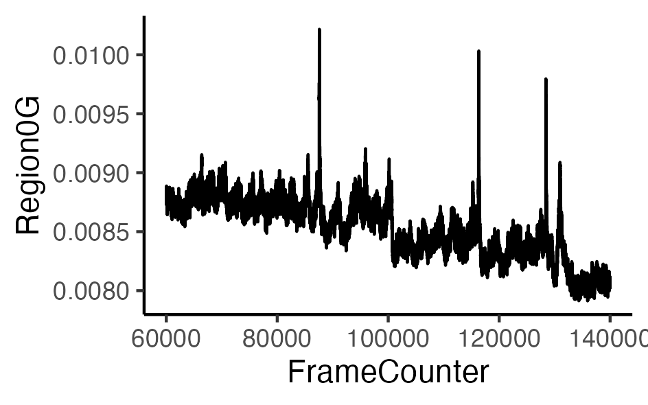

R script for analysis of fiber photometry, behavior, and body temperature
================


## Introduction

Fiber photometry is a way to record neuronal calcium events in animals during naturalistic behavioral and physiological responses. These three scripts serve three function. (1) Process fiber photometric data to yield different options of dF/F. (2) Align the dF/F data with behavior and body temperature data steams. (3) Aggregate multiple experiments for perform statistics.

## Installation
* One option is to install these scripts by cloning them with Git :

    For this, run the following commands :

    ```
    cd folder/to/clone/into
    git clone https://github.com/adamcnelson/Fiber_photometry
    ```

## Script 1: processing FP data from the Neurophotometrics system.
 
 Features:

-   Bleach detrending 
-   Data smoothing
-   Remove high-frequency noise 
-   Trim off fluorescence values from the first last/minutes of recording (user defined)
-   Baseline correction
-   Date-time timestamp (POSIXct)
-   Find peaks
-   Calculate dF/F using a number of different methods

### Example dataset
The following data was read in from the [Neurophotometrics system using a Bonsai workflow](https://neurophotometrics.com/bonsai-manual). Note that in this workflow the fluorescence data and associated timestamp values are read in as separate files.

``` r
all_dat
```


``` r
computerClock
```


### Smooth data 
The ButterEndEffect function removes high-frequency noise
``` r
ButterEndEffect
```
Before

After


Alternatively, you can use the `rollapply` function to smooth the data with a rolling average

### Convert fluorescence values at beginning / end of recording to `NA`
The beginning and end of a fiber photometry recording is very often noisy due to artifacts. The trim_region0G function converts calcium fluorescence values to NA for a user-defined number of minutes. 
We often remove fluorescence the first 10 minutes (~20,000 rows at 30 Hz). 
We can then visualize the 
 ``` r
trim_region0G
```

------------------------------------------------------------------------

Authors: Adam Nelson
